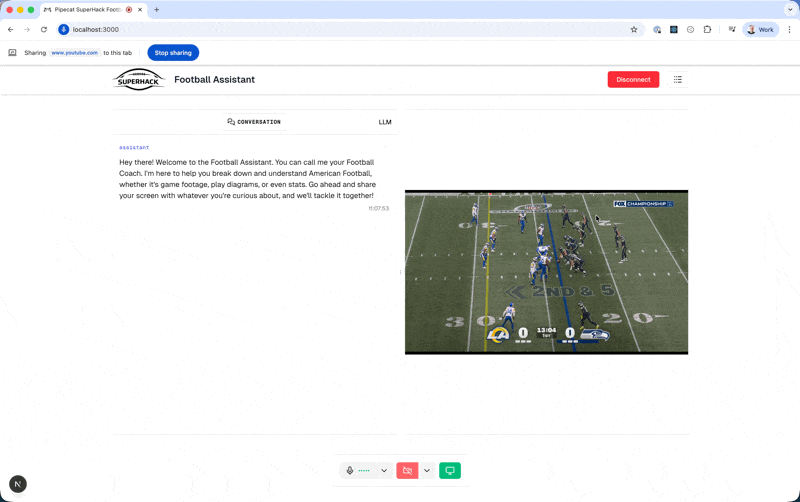

# Gemini 3 Superhack Starter Kit

A starter kit for the [Gemini 3 Superhack](https://cerebralvalley.ai/e/gemini-3-superhack) event hosted by Google DeepMind and Cerebral Valley on January 31, 2025.

This repository demonstrates how to wire up Google Gemini Live with Pipecat and the Pipecat Voice UI Kit, including optional screensharing and a resizable, log-aware UI, then deploy the agent to Pipecat Cloud.

## What this starter kit includes

- **Real-time conversation** powered by Gemini Live via Pipecat
- **Screensharing** (desktop) side-by-side with the conversation; stacked on narrow viewports
- **Resizable layout** using Voice UI Kit resizable panels and handles
- **Event logs panel** you can toggle and resize
- **One-click connect** to a Daily room for WebRTC transport
- **Example bot** configured as an American Football educational assistant (customize for your hackathon project!)



## Project structure

- `client/`: Next.js app with Voice UI Kit components and resizable layout
- `server/`: Python bot integrating Gemini with Pipecat

## Run locally

### Prerequisites

- Node.js 18+ and npm
- Python 3.10+ and [`uv`](https://github.com/astral-sh/uv)
- Daily API key (or a Daily room URL for local development)
- Google API key for Gemini
- Required API keys for the server bot (see `server/env.example`)

### 1. Start the server (Pipecat bot)

```bash
cd server
cp env.example .env
# Edit .env and set:
# - DAILY_API_KEY (required) - or DAILY_ROOM_URL for local dev
# - GOOGLE_API_KEY (required)
uv sync
uv run bot.py --transport daily
```

**Note:** If you set `DAILY_API_KEY`, rooms will be created dynamically and no sample room URL is needed. Alternatively, you can set `DAILY_ROOM_URL` to join the bot to a specific room repeatedly for local development.

This starts the local WebRTC server. Keep it running.

### 2. Start the client (Next.js + Voice UI Kit)

```bash
cd client
cp env.example .env.local
npm install
npm run dev
```

Open `http://localhost:3000` and click Connect. You can share your screen (desktop), converse with the agent, toggle logs, and resize panels.

> **Tip:** For best results when analyzing video content (especially NFL sports with frequent camera angle changes), pause the video before asking questions. The exact timing of when the bot interprets the video can vary, so pausing ensures the bot analyzes the specific frame you're asking about rather than a different moment in the playback.

## Deploy to Pipecat Cloud

> **Important**: Since this demo sends video to the bot (for screensharing), it increases CPU usage significantly. Deployed agents should use the **agent-2x** profile, which is already configured in `server/pcc-deploy.toml`.

Follow the official quickstart to build and deploy a Docker image, configure secrets, and run your agent in production:

1. **Sign up** for [Pipecat Cloud](https://pipecat.daily.co) and set up Docker
2. **Configure** `server/pcc-deploy.toml` (agent name, image, scaling)
3. **Upload secrets** from your `.env`:

```bash
uv run pcc secrets set <your-secret-set> --file .env
```

4. **Build and deploy**:

```bash
uv run pcc docker build-push
uv run pcc deploy
```

5. **Update client config**: Set `BOT_START_URL` and `BOT_START_PUBLIC_API_KEY` in `client/.env.local` and connect from your [locally running](#2-start-the-client-nextjs--voice-ui-kit) client.

## Customizing for your hackathon project

The included bot (`server/bot.py`) is configured as an American Football educational assistant. You can customize it for your hackathon project by:

1. Modifying the `SYSTEM_INSTRUCTION` in `server/bot.py` to change the bot's role and expertise
2. Updating the initial welcome message to match your project's purpose
3. Adjusting the client UI in `client/app/ClientApp.tsx` to match your application's needs

## Useful links

- **Gemini 3 Superhack:** [cerebralvalley.ai/e/gemini-3-superhack](https://cerebralvalley.ai/e/gemini-3-superhack)
- Voice UI Kit docs: `https://voiceuikit.pipecat.ai/`
- Pipecat docs: `https://docs.pipecat.ai/`
- Daily docs: `https://docs.daily.co/`
- Gemini docs: `https://ai.google.dev/docs`
